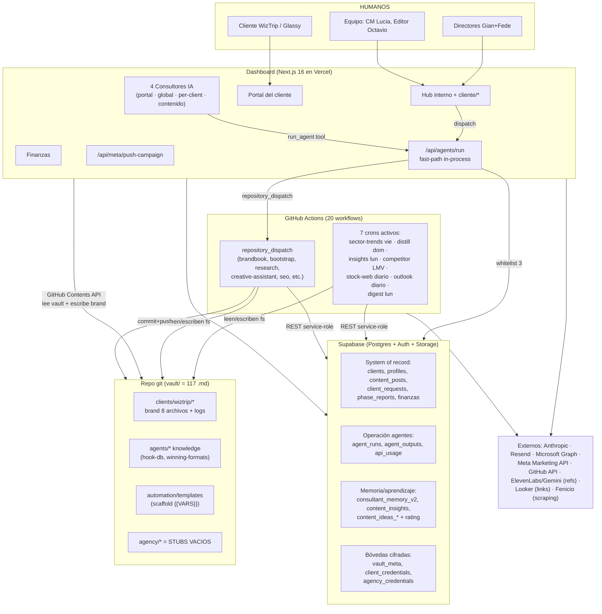

# 02 — Mapa del sistema actual

> Auditoría AI Company OS · 2026-08-07 · evidencia sobre `main` @ `ceb0aa0`.
> Dimensiones: 20 workflows GHA · 17 módulos en `scripts/` · dashboard Next.js 16 con 87 API
> routes y 55 páginas · 87 migraciones + `schema.sql` + 2 SQL en vault (≈49 tablas) · vault
> Obsidian con 117 `.md` · 25 págs de Manual Growth (PDF externo, entregado en esta auditoría).

## Diagrama 1 — Arquitectura actual

## Cómo se ejecuta trabajo hoy (3 vías verificadas)

| Vía | Mecánica | Quién la usa | Evidencia |
|---|---|---|---|
| **Cron GHA** | 7 schedules activos; leen vault por filesystem, escriben Supabase por REST, commitean vault | sector-trends, distill-learnings, insights-aggregator, competitor-scanner, stock-web, outlook-renew, weekly-digest | `.github/workflows/*` (mapa completo en doc 06) |
| **Dispatch on-demand** | UI/consultor → `/api/agents/run`: whitelist FAST corre in-process en Vercel (morning-briefing, reporting query/insights); el resto va por `repository_dispatch` a GHA | Botones del dashboard + tool `run_agent` de los consultores | `dashboard/app/api/agents/run/route.ts:43-83` |
| **Endpoints IA directos** | Rutas del dashboard que llaman a Anthropic en el request (consultores, phases/generate, creative-assistant, brandbook wizard…) | Chat del portal/equipo, generación de fases, briefs | 13+ call sites con `recordApiUsage` |

## Componentes del monorepo

| Pieza | Qué es | Estado |
|---|---|---|
| `dashboard/` | Producto central: hub interno + portal cliente + finanzas + consultores | **Producción** (Vercel) |
| `scripts/` | 15 agentes/jobs + `lib/` compartida + 2 utilidades admin (`admin-set-password.mjs`, `admin-remove-mfa.mjs`) | Producción (via GHA/fast-path) |
| `vault/` | Markdown: contexto por cliente + knowledge de agentes + templates + stubs de agencia | Mixto (ver doc 03) |
| `landing/` | Landing pública de la agencia (HTML estático + `vercel.json`) | Deploy propio |
| `kickoff/` | Página HTML de kickoff (estática) | Deploy propio |
| `remotion-studio/` | **NO EXISTE en main** (removido junto con el agente content-creator) | Eliminado |

## Hechos de arquitectura (verificados)

1. **El dashboard no lee el vault por filesystem**: usa GitHub Contents API con cache 5 min
   (`dashboard/lib/vault-loader.ts`) y escribe brand/ vía PUT (`lib/vault-writer.ts`). Los
   agentes GHA sí leen/escriben filesystem y commitean.
2. **DDL fragmentado en 3 fuentes**: `dashboard/supabase/schema.sql` (14 tablas base),
   87 migraciones (35 tablas más), y `vault/automation/supabase-schema*.sql` (agent_runs,
   content_pieces, content_insights, competitor_pieces, consultant_memory legacy). Tablas como
   `agent_outputs`/`notifications` no tienen CREATE TABLE versionado localizable en una sola
   fuente → riesgo de drift entre repo y base real.
3. **4 registries de agentes implícitos y desalineados**: catálogo UI (7 en `lib/agents.ts`),
   `DISPATCHABLE_AGENTS` del consultor (8, `app/api/consultant/route.ts:32`), `FAST_AGENTS`
   (3 claves, `app/api/agents/run/route.ts:43`), y los 20 workflows. Ninguno es fuente única.
4. **Sin RAG/embeddings/semantic search**: cero hits de `embedding|pgvector|vector` en código
   de app. El contexto llega por carga completa de archivos por path convencional + builders
   con truncado (`buildVaultBlock` 16k chars, `buildSectorTrendsBlock` 3.5k, etc.).
5. **Doc maestra desactualizada**: `CLAUDE.md` y `vault/CLAUDE.md` aún describen
   content-creator/Remotion como prioridad #1, n8n reemplazado, Google Sheets, Blotato y
   Telegram como stack activo — nada de eso está operativo en main (content-creator y
   remotion-studio eliminados; Telegram solo vestigial en `scripts/lib/supabase.js`; Blotato
   solo aparece en un comentario de `agents/run`).
