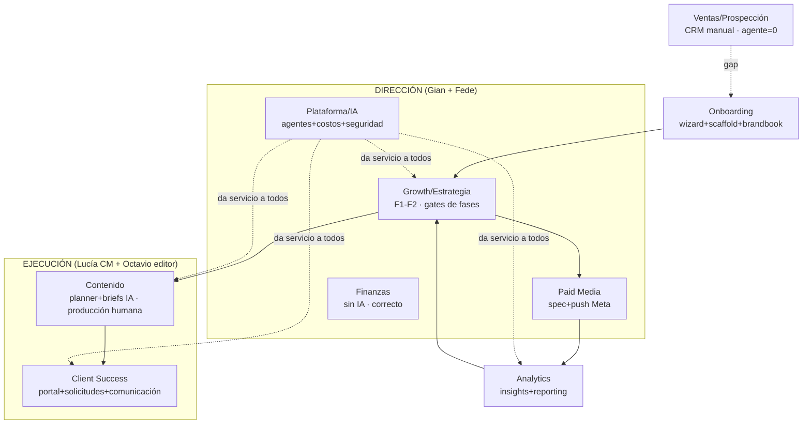

# 04 — Mapa actual de la empresa (derivado de evidencia)

> Áreas derivadas de: Manual Growth (5 fases reales del PDF), módulos construidos en el repo,
> y operación humana observable (roles: Gian dirección+arquitectura, Fede frontend+dirección,
> Lucía CM/account lead, Octavio editor de video). No se copiaron las 20 áreas candidatas del
> brief: se consolidó a **9 áreas reales** + 2 declaradas-sin-build.

## Consolidaciones aplicadas (con justificación)

- **Market Intelligence ⊂ Growth**: diagnóstico/competencia/tendencias son actividades de las
  fases F1/F5 del Manual, no un departamento (sector-trends + competitor-scanner +
  client-research son herramientas de Growth).
- **Reporting ⊂ Analytics**: el reporte mensual es el entregable de F5.5; mismo dueño y datos.
- **UGC/Influencers = skill/proceso de Contenido** (Manual F3.1.2/3.3), hoy fuera del sistema.
- **CRO/Funnel = práctica dentro de Growth** (checklists F1.4/3.5/4.4/5.3 del Manual), sin
  tooling propio — no es área organizacional.
- **SEO = capacidad utilitaria** (un agente), no área con dueño.
- **Stock/Logistics = módulos por-cliente de la vertical automatización** (aplican a ecommerce),
  no áreas de la agencia.
- **Prospección/Ventas se mantiene como área** aunque casi sin build, porque tiene proceso
  humano real (pipeline CRM) y visión declarada.

## Matriz 1 — Área × Proceso

| Area | Process | Current Agent | Current Skill | Current Workflow | Automation Level | Human Owner | Missing | Target |
|---|---|---|---|---|---|---|---|---|
| **Growth/Estrategia** | F1 Diagnóstico | phases/generate (IA) + client-research + competitor-scanner | ROAS BE (manual, planilla) | phase_reports gate | **Media** (draft IA, aprueba director) | Gian | tooling de mercado (SimilarWeb/Foreplay = manual externo); checklist F1 no versionada | IA prepara todo el diagnóstico con fuentes; director edita/aprueba |
| | F2 Estrategia | phases/generate | — | phase_reports gate | Media | Gian | proyección/inversión no modelada en sistema | plan estructurado (canales, inversión, ICP) como datos, no solo texto |
| **Contenido** | F3 planificación | content-strategy | trends block, brand block | dispatch on-demand | Media-alta | Lucía | cron pausado; calendario no auto-mensual | ciclo mensual semiautomático con gate |
| | F3 ideación/briefs | creative-assistant + consultor de contenido | hooks (semi-vacío), memoria | endpoint + batch gate | **Alta** en ideación | Lucía | hook/winning DBs pobres; UGC fuera del sistema | briefs alimentados por winners reales |
| | F3 producción | — (humana; content-creator eliminado) | generateAiPrompt p/ herramientas | — | **Baja** (correcto hoy) | Octavio | tracking de producción por pieza (status parcial) | humano + IA-assist (prompts, variantes) |
| | F3 publicación | — | — | manual (Meta Business Suite) | **Nula** | Lucía | programación via API (Blotato no implementado) | YELLOW: programar con aprobación |
| **Paid Media** | F4 lanzamiento | generate-campaign-spec → push-campaign | spec estructurado | gate humano + Marketing API | **Media** | Gian | lectura de resultados (Insights API) | spec IA + push aprobado + monitoreo automático |
| | F5 optimización | — | — | manual en Ads Manager | Nula | Gian | señales/alertas de CAC-ROAS | recomendaciones IA + acción humana |
| **Analytics** | métricas contenido | insights-aggregator (+social-media-metrics dormido) | scoring engagement | cron lunes | Media | Gian | **ingestion automática de métricas** (hoy manual) | pipeline métricas → winners → briefs |
| | reporting negocio | reporting-performance + Looker + kpi_snapshots | modos query/insights | fast-path + on-demand | Media | Gian | crons pausados; reporte mensual F5.5 no automatizado E2E | reporte mensual draft IA + aprobación |
| **Client Success / Portal** | comunicación cliente | Consultor portal + digest + trends mail + notifs | contexto filtrado (privacidad) | crons lunes/viernes + UI | **Alta** | Lucía | — | mantener |
| | solicitudes/ofertas | — (flujo humano con estados) | forms estructurados (paquetes) | client_requests gates | Media | Lucía | SLA/recordatorios | igual + recordatorios |
| **Onboarding** | alta de cliente | client-bootstrap + brandbook-processor + wizard | templates {{VARS}}, validación 8 secciones | dispatch × 2 + invitación | **Alta** | Gian | — | mantener |
| **Ops interna / Equipo** | tareas, asignaciones, briefings | morning-briefing (on-demand) + consultor global | run_agent, save_memory | hub + tareas + dev_tasks | Media | ambos directores | briefings pausados (nadie los usaba) | copiloto global como router |
| **Finanzas / Back office** | facturación, egresos, dividendos, cuentas, presupuestos | — (sin IA, por diseño) | multimoneda USD/UYU | módulo finanzas + audit_log | Tooling sin IA (**correcto**) | Gian+Fede | conciliación bancaria automática (futuro) | RED: siempre humano; IA solo lectura/resumen |
| **Plataforma/Automatización** | agentes, costos, seguridad | distill-learnings + api_usage + auditoría | client-memory, anthropic lib | crons + panel costos + audit_log | Alta | Gian | registry único; tests; alerting | ver doc 10 |
| **Ventas/Prospección** | pipeline, outreach | **ninguno** (prospecting=stub) | scoring-model.md (stub) | pipeline CRM manual | **Nula** | Gian | todo (si es prioridad) | AI-assisted: research+scoring+drafts, envío humano |
| *(Declarada sin build)* | UGC/influencers | — | — | — (UGC Point/Pooshlo externos, Manual F3.1.2/3.3) | Nula | Lucía | tracking de colaboraciones | BUY+CONNECT |

## Diagrama 2 — Mapa organizacional actual

## Nivel de automatización y madurez por área (síntesis)

| Área | Madurez | Lectura honesta |
|---|---|---|
| Onboarding | ★★★★ | El flujo más redondo: wizard → scaffold → brandbook → portal |
| Contenido (ideación) | ★★★★ | Fuerte en idear/briefear; débil en métricas de vuelta |
| Client Success | ★★★★ | Portal maduro; comunicación semanal automática |
| Plataforma | ★★★☆ | Loop de aprendizaje nuevo; faltan registry único/tests/alerting |
| Growth F1-F2 | ★★★☆ | Fases con IA+gate; insumos de mercado siguen manuales |
| Analytics | ★★☆☆ | Estructura lista; **sin ingestion automática de métricas** |
| Paid Media | ★★☆☆ | Push a Meta existe; falta el ciclo de lectura/optimización |
| Finanzas | Tooling ✔ | Sin IA a propósito — mantener |
| Ventas | ☆ | CRM manual; agente inexistente pese a la visión |
