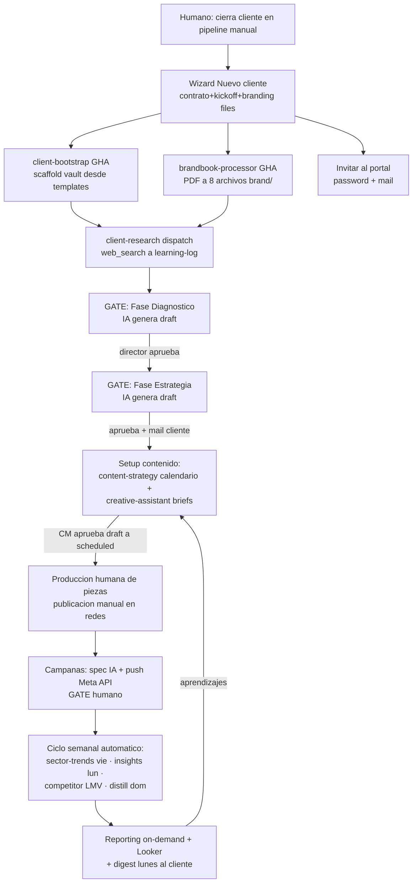
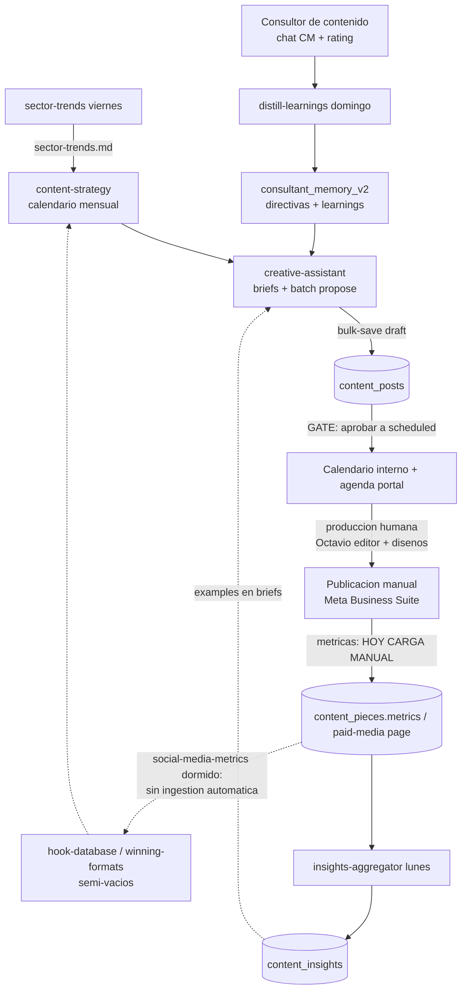

# 06 — Inventario de workflows

## A. Los 20 workflows de GitHub Actions (verificado en `.github/workflows/`)

| Workflow | Trigger | Estado | Ejecuta | Notas |
|---|---|---|---|---|
| sector-trends | cron `0 12 * * 5` + dispatch | **ACTIVO semanal** | loop clientes GP → script + mail send-all | commitea vault |
| distill-learnings | cron `0 13 * * 0` + dispatch | **ACTIVO semanal** | loop GP → Haiku → memoria | no commitea |
| insights-aggregator | cron `0 11 * * 1` + rep.dispatch | **ACTIVO semanal** | agregación determinística | |
| competitor-scanner | cron `0 14 * * 1,3,5` + rep.dispatch | **ACTIVO 3×sem** | parser competitors.md → tabla | |
| stock-web | cron `0 11 * * *` + rep.dispatch | **ACTIVO diario** | scraper Fenicio | único diario "de negocio" |
| outlook-subscription-renew | cron `0 10 * * *` | **ACTIVO diario** | curl al endpoint subscribe (renueva Graph) | infra, barato |
| portal-weekly-digest | cron `0 12 * * 1` | **ACTIVO semanal** | curl a digest/send-all (Resend) | email |
| daily-morning-briefings | ~~cron diario~~ comentado | **PAUSADO** (jul 2026, costo) | matrix por cliente | reactivable a mano |
| daily-user-briefings | ~~cron diario~~ comentado | **PAUSADO** | matrix por usuario | idem |
| content-strategy | ~~cron lunes~~ comentado + rep.dispatch | on-demand | | |
| morning-briefing | ~~cron~~ + rep.dispatch | on-demand | | fast-path preferido |
| reporting-performance | ~~crons d/w/m~~ + rep.dispatch | on-demand | | modos |
| social-media-metrics | ~~crons~~ + rep.dispatch | on-demand | | |
| stock | ~~crons~~ + dispatch + rep.dispatch | on-demand | | recibe trigger de logistics |
| logistics | ~~crons~~ + rep.dispatch | on-demand | dispara stock | |
| seo-agent | dispatch + rep.dispatch | on-demand | | |
| creative-assistant | dispatch + rep.dispatch | on-demand | | también corre como endpoint |
| client-research | dispatch + rep.dispatch | on-demand | | |
| brandbook-processor | dispatch + rep.dispatch | on-demand | | wizard |
| client-bootstrap | dispatch + rep.dispatch | on-demand | | wizard |

Patrón operativo sano ya adoptado: **crons semanales baratos + todo lo demás on-demand**
(decisión de costos jul 2026 tras tocar el tope de minutos).

## B. Workflows de negocio implementados EN el dashboard (no-GHA)

| Flujo | Estados | Human gates | Evidencia |
|---|---|---|---|
| **Fases Growth (F1-F2 del Manual)** | pending → generating → draft → changes_requested → approved | Director aprueba/pide cambios; mail al cliente al aprobar | `phase_reports` + `/api/phases/*` + `emailPhaseApprovedToClient` |
| **Contenido (F3)** | draft → scheduled (aprobada) → published | canEditContent aprueba; publicación real manual en redes | `content_posts` + página contenido |
| **Solicitudes del cliente** | pending → reviewing → in_progress → done/rejected | Director asigna y responde; team asignado mueve status | `client_requests` + triggers de notifs/mails |
| **Ofertas/paquetes** | (mismo ciclo, vista registro) | equipo ejecuta | `/portal/ofertas` + `/cliente/[id]/ofertas` |
| **Onboarding de cliente** | wizard → bootstrap (scaffold) → brandbook-processor → invitación portal | Humano completa wizard; passwords/vault gates | wizard + 2 workflows dispatch |
| **Campañas Meta** | generate-campaign-spec (IA) → push-campaign (Marketing API) | Humano revisa spec y ejecuta push | `/api/meta/generate-campaign-spec` + `/api/meta/push-campaign` |
| **Bóvedas de credenciales** | setup passphrase → depósito cliente → unlock equipo | Todo humano por diseño (envelope crypto) | migs 062/065/075 |
| **Finanzas** | ingresos/egresos/facturas/dividendos/cuentas | 100% humano (correcto) | módulo finanzas |

## Diagrama 7 — New Client end-to-end (como corre HOY)

## Diagrama 8 — Content end-to-end (como corre HOY)

**Cuello de botella evidenciado**: el tramo métricas→aprendizaje depende de carga manual
(`content_pieces.metrics`, página paid-media). Hasta no conectar lectura de métricas (Meta
Insights API), `social-media-metrics` y el loop de winners quedan a media máquina.
