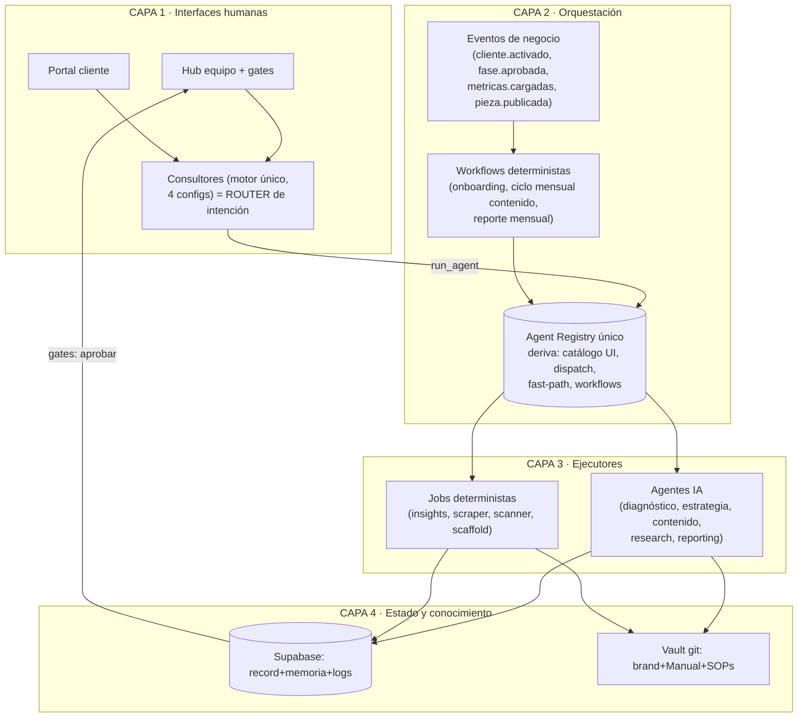
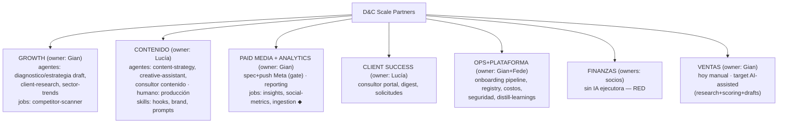
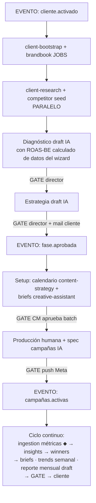

# 10 — Target Operating Model (diseño, NO implementado)

## A. Evaluación de las 4 opciones de arquitectura

| Opción | Descripción | Veredicto para D&C |
|---|---|---|
| **A — Orquestador central** | Un agente maestro planifica y delega todo | ✘ Sobredimensionado: un solo punto de falla/costo, agrega latencia y opacidad a flujos que ya son deterministas. El "CEO-agent" es teatro al tamaño actual (2 socios, 2-3 team, 2-3 clientes). |
| **B — Managers por departamento + workers** | Un manager-agent por área coordina worker-agents | ✘ La empresa tiene ~5 humanos; añadir 9 managers sintéticos duplica jerarquía sin volumen que lo justifique. Los "managers" reales son Gian/Fede/Lucía con gates en el dashboard. |
| **C — Event-driven puro sin manager** | Todo por eventos y colas | ◐ Correcto para lo mecánico, pero solo-eventos deja afuera la interacción conversacional que ya funciona (consultores) y sobre-ingenieriza los gates humanos. |
| **D — Híbrida** | Workflows deterministas + eventos para lo mecánico; consultores como routers de intención; gates humanos en el dashboard | ✔ **RECOMENDADA** — es además la dirección que el sistema ya tomó orgánicamente; el target la formaliza y cierra los huecos. |

## B. La arquitectura target (Opción D formalizada)

**Principios**: (1) least-autonomous-component; (2) coordinación por datos y eventos, no por
conversaciones agente-agente; (3) todo lo visible al cliente pasa por gate humano hasta ganarse
el GREEN; (4) un solo registry; (5) conocimiento versionado en git, estado en Postgres.

**Qué se agrega vs hoy (delta honesto — poco y quirúrgico):**
1. **Registry único de agentes** (config con: nombre, tipo agente/job, triggers, brief-schema,
   canal fast/GHA, límite de gasto, owner) → de él derivan las 4 listas hoy duplicadas.
2. **Eventos de negocio explícitos**: hoy existen triggers SQL de notifs; formalizar 4-6
   eventos con handlers (cliente.activado→research+diagnóstico draft; fase.aprobada→siguiente;
   métricas.cargadas→social-media-metrics; contenido.publicado→tracking).
3. **Motor común de consultores** (4 configs sobre un solo código: contexto+tools+persistencia).
4. **Ingestion de métricas Meta** (lectura Insights API) — el dato que cierra los loops de
   winners/reporting/optimización.
5. **Workflow state mínimo** para los 2 procesos multi-paso (onboarding y ciclo mensual):
   una tabla `process_instances` (proceso, cliente, paso, estado) — NO un motor de workflows.

**Qué NO construir** (decisión explícita): manager-agents por área; vector DB; colas externas
(Kafka/Redis — GitHub dispatch + triggers SQL alcanzan); multi-repo; capa nueva de aprobaciones
(los gates ya viven en el dashboard); más consultores.

## C. Jerarquía organizacional target

Cada área = **owner humano + set de agentes/jobs + gates**. Sin manager-agents: el "manager" es
el humano con su dashboard; los consultores son la interfaz conversacional, no jefes.

## D. Orquestación del flujo New Client (target — diagrama 5)

Paralelizable: research+competitor; calendario+briefs. Secuencial duro: diagnóstico→estrategia
→setup (dependencia de contenido intelectual). Outputs estructurados en cada paso (ya lo son:
phase_reports, content_posts, campaign spec). Human gates: 4 (los mismos de hoy).
