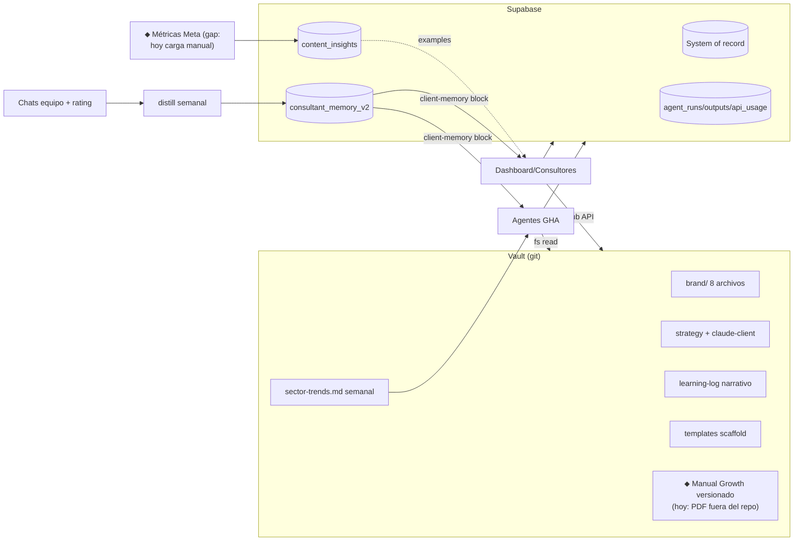

# 11 — Arquitectura de datos y memoria

## A. Inventario clasificado (≈49 tablas + vault + storage)

| Categoría | Piezas actuales | Veredicto |
|---|---|---|
| **SYSTEM OF RECORD** | `clients, profiles, client_assignments, content_posts, client_requests, phase_reports(+history/comments), objectives, payments, expenses, manual_revenues, dividend_*, cuentas_bancarias(+movimientos), client_fee_schedules, finanzas_documents, client_contacts, integrations, cal_events, leads, prospect_campaigns, dev_tasks, team_*` | Correctamente en Postgres con RLS |
| **WORKFLOW STATE** | estados dentro de las tablas (status de fases/contenido/solicitudes) + `outlook_connections` | Suficiente; no existe "workflow engine" ni hace falta aún |
| **AGENT OPS / EVENT LOG** | `agent_runs` (toda ejecución), `agent_outputs` (entregables), `notifications` | Sano. Gap: outputs sin clave de idempotencia |
| **AGENT MEMORY** | `consultant_memory_v2` (scopes user/client, kinds, importance, expiración) + legacy `consultant_memory` + `learning-log.md` + `content_ideas_*` (+rating) | Patrón correcto; **3 sistemas conviviendo** → consolidar en v2 + learning-log como narrativa |
| **KNOWLEDGE** | vault clients/brand/strategy + `content_insights` + `competitor_pieces` + hook/winning files | Dual sano (narrativa en git, rankings en DB); capa agencia vacía |
| **AUDIT / METERING** | `audit_log` (solo director) + `api_usage` (+pricing) | Por encima del promedio |
| **ARTIFACTS** | Storage buckets (onboarding files, content previews, PDFs de fases/facturas) | OK |
| **CONFIG** | `clients.modules/onboarding/external_links`, `kpi_snapshots`, `routing_rules`, vault templates | OK |
| **Bóvedas** | `vault_meta`, `client_vaults`, `client_credentials`, `agency_credentials` (envelope RSA+AES, passphrase humana) | Diseño correcto; RLS service-role-only |

## B. Problemas estructurales encontrados

1. **DDL fragmentado**: 3 fuentes (schema.sql, 87 migraciones, `vault/automation/supabase-schema*.sql`)
   y tablas activas sin CREATE TABLE localizable en el repo (`agent_outputs`, `notifications`
   nacen en archivos día-2 del vault / manualmente). Sin herramienta de migración (se pegan a
   mano en SQL editor) → el esquema real de prod solo se conoce empíricamente.
2. **Dualidad vault↔DB con fuente clara solo a veces**: tendencias (md + agent_outputs: ambos
   consumidos — OK, dual write intencional), contenido (content-library.md casi abandonado vs
   `content_posts` = fuente real), métricas (metrics-log.md narrativo vs
   `content_pieces.metrics`+`kpi_snapshots` = fuente real). Documentar cuál manda en cada par.
3. **`content_pieces` vs `content_posts`**: dos tablas de contenido de generaciones distintas
   del sistema (pieces = era content-creator; posts = planner actual). `content_pieces` queda
   como fuente de `insights-aggregator` → decidir si se conserva como tabla de métricas o se
   migra su rol a content_posts.
4. **Sin retrieval selectivo** (por diseño, aceptable hoy): riesgo latente de dilución de
   prompts al crecer clientes/historia; el truncado por chars ya recorta aprendizajes viejos.

## C. Rol objetivo de cada almacén (recomendación)

| Almacén | Rol target |
|---|---|
| **Supabase** | ÚNICA fuente de estado operacional + memoria estructurada + logs/metering. Consolidar DDL en `dashboard/supabase/migrations/` (una migración "baseline reconstruida" desde prod). |
| **Vault (markdown en git)** | Conocimiento cualitativo y narrativo: brand, estrategia, SOPs, Manual Growth versionado, aprendizajes narrativos. Frontmatter mínimo (`type/client/updated`) SOLO si se construye tooling encima. |
| **Obsidian (app)** | Interfaz humana de lectura/edición del vault. Nada más — no es runtime. |
| **Git** | Versionado de conocimiento + outputs regenerables (histórico de tendencias vía commits). |
| **Vector DB** | **NO ahora.** Revisar cuando: >15-20 clientes, o historiales que no entren en presupuesto de contexto, o búsqueda cross-cliente real. Si llega: pgvector en el mismo Supabase (no infra nueva). |
| **Registries** | Un `agents.registry` único (tabla o JSON versionado) del que deriven: catálogo UI, DISPATCHABLE, FAST y validación de workflows — hoy 4 listas a mano. |

## Diagrama 6 — Flujo conocimiento / memoria / datos (actual + fix propuestos ⬥)

