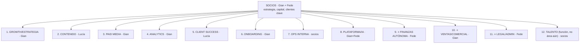

# 15 — Estructura empresarial target (ampliada y profesional)

> Extensión aprobada por Gian (2026-08-07) sobre la auditoría base: la empresa no se limita a
> formalizar lo existente — define su estructura completa, elimina lo muerto, crea lo que falta
> y registra el camino hacia orquestadores conversacionales (doc 17).

## El organigrama target — 12 áreas

Cada área = **misión + owner humano + flota (agentes/jobs) + gates + KPIs**. Los "managers"
son humanos hasta H2 (doc 17); las áreas nuevas están marcadas ⭐.

| # | Área | Misión | Owner | Flota hoy → target | KPIs del área |
|---|---|---|---|---|---|
| 1 | Growth/Estrategia | Diagnóstico y plan de crecimiento por cliente según el Manual (5 fases) | Gian | phases-draft, client-research, sector-trends, competitor-scanner → + checklist F1 tooled, objetivos F2.8 como datos | tiempo diagnóstico (5-7d → <2d de juicio), % drafts aprobados sin reescritura |
| 2 | Contenido | Contenido que convierte, alineado a marca y winners | Lucía | content-strategy, creative-assistant, consultor contenido, hooks/winners → + winners con métricas reales, UGC tracking | % briefs aprobados, piezas/semana, tiempo idea→publicada |
| 3 | Paid Media | Adquisición rentable (CAC/ROAS dentro de objetivo) | Gian | spec+push Meta → + ingestion Insights, alertas de desvío, recomendaciones de presupuesto (YELLOW) | CAC vs objetivo, ROAS vs break-even, tiempo detección de fatiga |
| 4 | Analytics | Verdad numérica del negocio y de cada cliente | Gian | reporting-performance, insights-aggregator, social-media-metrics (a despertar), kpi_snapshots, Looker | reporte mensual on-time, % datos auto vs manual |
| 5 | Client Success | Cliente informado, escuchado y retenido | Lucía | consultor portal, digest, trends mail, solicitudes/ofertas | NPS implícito (uso portal), tiempo de respuesta, retención |
| 6 | Onboarding | De contrato firmado a operación andando sin fricción | Gian | wizard, client-bootstrap, brandbook-processor, portal-access | días contrato→diagnóstico entregado |
| 7 | Ops interna | Coordinación del equipo, tareas, asignaciones | socios | consultor global, morning-briefing on-demand, tareas/dev_tasks | tareas vencidas, carga por persona |
| 8 | Plataforma/IA | El sistema mismo: registry, costos, seguridad, aprendizaje, evals | Gian+Fede | distill-learnings, api_usage+panel, audit_log, bóvedas → + registry único, eventos, alerting, evals | costo IA/cliente, % crons verdes, tasa aprobación por agente |
| 9 | ⭐ **Finanzas Autónoma** | Plata bajo control sin consumir a Fede: tesorería bi-moneda, facturación, cobranzas, conciliación, cierre | **Fede** | módulo finanzas (tooling) → **+ 5 capacidades del doc 16** | horas Fede/mes en finanzas, días de cierre, % facturas a tiempo, % conciliado auto, descalces anticipados |
| 10 | ⭐ Ventas/Comercial | Pipeline propio de la agencia: research → scoring → outreach (envío humano) → cierre humano | Gian | pipeline CRM manual → + prospect-research, scoring determinístico, outreach-drafts | leads calificados/mes, reuniones agendadas, tasa cierre |
| 11 | ⭐ Legal/Admin | Contratos y obligaciones bajo control | Fede | contratos ya se suben en wizard (sin gestión) → + repositorio de contratos con vencimientos, recordatorios de renovación, checklist de alta/baja de cliente | contratos vigentes sin vencer, renovaciones anticipadas ≥30d |
| 12 | Talento | (función dentro de Ops hasta tener volumen) alta/baja, pagos funcionales, trayectoria — parcialmente existe (team, salary_history, milestones) | socios | equipo/asignaciones/funcionales → formalizar como área recién con ≥8-10 personas | — |

## Balance KEEP / DELETE / CREATE (el equilibrio pedido)

### ✅ KEEP — se usa y se queda (no tocar salvo mantenimiento)
Flota completa actual (11 agentes IA + 4 jobs + 4 consultores), módulo finanzas (tooling),
portal del cliente entero, hub interno, pipeline de onboarding, loop de aprendizaje, bóvedas,
gates existentes (fases/contenido/solicitudes/campañas), crons semanales, panel de costos,
capa `vault/clients/` + templates.

### 🗑️ DELETE — no se usa para nada (PR de limpieza en Stage 0, reversible por git)
| Ítem | Evidencia de muerte | Acción |
|---|---|---|
| `vault/agents/content-creator/*` (spec+prompt-library) | el agente fue eliminado de main | mover a `_archive/` |
| `dashboard/lib/mock-data.ts` | 0 importers | borrar |
| `consultant_memory` (tabla legacy) | solo la usa el consultor per-client; v2 es el estándar | migrar filas → v2, dropear |
| `hook-database.md` duplicado (nivel agente Y nivel cliente) | dos ubicaciones, ambas casi vacías | consolidar en una (nivel cliente) |
| `vault/automation/shared-utils/*.md` | stubs sin lectores | archivar |
| `vault/_archive/dmancuello*` | cliente archivado 2026 | confirmar con socios → borrar del working tree (queda en git) |
| Referencias muertas en env/docs: ElevenLabs, Google AI, Blotato, Telegram, n8n, Sheets | sin consumidor en código | limpiar de workflows/CLAUDE.md; conservar secrets solo si hay plan de uso |
| `content_pieces` (tabla) | generación anterior; hoy solo la lee insights-aggregator | decidir en FIN de Stage 2: migrar métricas a content_posts o mantener como tabla de métricas renombrada |

### 🏗️ CREATE — falta y se conecta a lo existente
| Qué | Área | Se conecta a | Cuándo (roadmap v2) |
|---|---|---|---|
| Registry único de agentes (área/owner/triggers/límites) | Plataforma | deriva catálogo UI, DISPATCHABLE, FAST, workflows | Stage 0 |
| Manual Growth versionado + SOPs reales | Growth/todas | prompts de fases + onboarding humano | Stage 1 |
| **Área Finanzas Autónoma (5 capacidades, doc 16)** | Finanzas | módulo finanzas + fee_schedules + cuentas + mails | **FIN-0..3, arranca tras Stage 0** |
| Ingestion Meta Insights (lectura métricas) | Paid Media/Analytics | content_pieces.metrics + insights + reporting | Stage 2 |
| Eventos de negocio formales | Plataforma | triggers SQL + dispatch existente | Stage 5 |
| Motor único de consultores (4 configs) | Plataforma | 4 endpoints actuales | Stage 4 |
| Track Ventas (research+scoring+drafts) | Ventas | pipeline CRM + Apollo (CONNECT) | condicionado a prioridad comercial |
| Legal/Admin liviano (contratos+vencimientos+recordatorios) | Legal | onboarding.contractFile + cal/notifs | FIN-adjacente (comparte patrón de vencimientos) |
| Evals + tasa de aprobación por agente | Plataforma | datos ya existentes (fases/contenido) | Stage 2 |

## Principio rector de la estructura ampliada

**Toda área — nueva o vieja — se construye con foco en escala**: genérica por cliente (cero
hardcodeo), con owner humano claro, con sus gates definidos desde el día 1, con costo medido, y
con su tasa de aprobación registrada — porque esa métrica es la que después habilita H2/H3
(doc 17). Un área sin métricas de aprobación nunca podrá tener coordinador autónomo.
