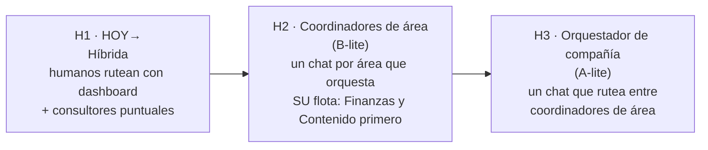

# 17 — Horizontes de evolución: de híbrida a orquestadores conversacionales

> Pedido explícito de Gian: dejar REGISTRADO el camino hacia "yo simplemente converso con
> orquestadores" (Opciones A/B), activable cuando se incorporen nuevos clientes y la
> estructura esté "sólida y sin errores". Este documento es ese plan: tres horizontes con
> **triggers medibles** (condiciones, no fechas), qué se pre-cablea desde ahora, y rollback.

## Visión de llegada (H3)

Gian abre el chat de la empresa y escribe: *"entró un cliente nuevo, es un ecommerce de
indumentaria en Paraguay, arrancá"* — y el orquestador coordina onboarding→research→diagnóstico
draft, avisándole solo en los gates. Fede escribe: *"¿cómo venimos este mes y a quién hay que
cobrarle?"* — y el coordinador de Finanzas responde con la posición bi-moneda y los
recordatorios drafteados para aprobar. **Los gates RED nunca desaparecen en ningún horizonte.**

## H1 — Híbrida (ahora): la base + el pre-cableado

Lo que ya se decidió (docs 10/14) MÁS lo que se instala desde el día 1 **pensando en H2/H3**
(esto es "generar las bases" que pidió Gian — barato hoy, imprescindible después):

1. **Registry único con metadata de orquestación**: cada agente/job declara `área, owner,
   triggers, brief-schema, límite de gasto mensual, nivel HITL por output`. Sin esto, un
   coordinador no puede saber qué puede pedir ni cuánto puede gastar.
2. **Tasa de aprobación por tipo de output** (medible con datos que ya existen: fases
   aprobadas/rechazadas, drafts→scheduled, 👍/👎). Es LA métrica de promoción: la autonomía se
   gana con historial, no se declara.
3. **Eventos de negocio formales** (Stage 5): un coordinador es, en el fondo, un traductor de
   intención a eventos/workflows — si los eventos existen, el coordinador es una capa fina.
4. **Motor único de consultores** (Stage 4): los coordinadores de H2 son *configuraciones* de
   ese motor (contexto de área + tools de su flota + gates), no software nuevo.
5. **Límites duros**: presupuesto por agente y por cadena, profundidad máxima de delegación
   (max 2 saltos), lista blanca de quién puede invocar a quién.

## H2 — Coordinadores de área (Opción B, versión sensata)

**Qué es**: un coordinador conversacional POR ÁREA que orquesta SOLO su flota. Fede habla con
"Finanzas"; Lucía con "Contenido". El coordinador: entiende el pedido, consulta estado, dispara
los agentes/workflows de su área, junta resultados, presenta para gates. NO cruza áreas.

**Primeras dos áreas**: Finanzas (cuando FIN-0..3 esté operativo y midiendo) y Contenido (la
de mayor volumen de outputs). Después: Growth y Paid Media.

**Triggers de activación (todos, no alguno)**:
- ≥5-6 clientes activos (el volumen que hace que rutear a mano canse), **o** el área alcanzó
  flota ≥6-8 unidades propias;
- tasa de aprobación ≥80% sostenida 2 meses en los tipos core del área;
- evals del área en verde + 0 incidentes P0 en 60 días;
- Stages 0-4 completos ("estructura sólida sin errores": registry, conocimiento, métricas,
  workflows con estado, motor de consultores).

**Qué NO cambia en H2**: los gates (el coordinador PREPARA aprobaciones, jamás las salta);
los límites de gasto; la prohibición de coordinador→coordinador.

**Riesgos y mitigación**: coordinador que "planifica de más" → scope estricto (rutear+resumir,
no inventar workflows); costo por conversación → presupuesto mensual por coordinador; deriva de
calidad → la tasa de aprobación se sigue midiendo y puede degradarlo.

## H3 — Orquestador de compañía (Opción A, versión con red de seguridad)

**Qué es**: un chat de compañía que rutea entre coordinadores de área y responde preguntas
cross-área ("¿qué cliente es menos rentable y por qué?"). Gian/Fede conversan con LA EMPRESA.

**Triggers**: ≥10 clientes activos; H2 estable ≥3 meses en ≥3 áreas; autonomía selectiva
(Stage 6) operando con promociones/degradaciones reales; presupuesto de cadena probado.

**Límites de diseño permanentes**: profundidad máxima orquestador→coordinador→agente (2
saltos); presupuesto por conversación y por cadena; todo dispatch queda en agent_runs con el
árbol de invocación; los RED (dinero, contratos, leads, credenciales, borrado) **jamás** se
delegan — en ningún horizonte, bajo ninguna métrica.

## Rollback (por qué esto no es apostar la empresa)

Cada horizonte es una CAPA sobre la anterior, no un reemplazo: apagar un coordinador (un flag
en el registry) devuelve el área a H1 con la flota intacta; apagar el orquestador devuelve a
H2. La inversa no es cierta — por eso el orden importa y por eso H1 sólida es prerequisito
innegociable, exactamente como lo planteó Gian.

## Resumen ejecutivo del compromiso

| Horizonte | Se activa cuando | Qué gana Gian/Fede |
|---|---|---|
| H1 (ya) | — | base sólida + Finanzas Autónoma + métricas de aprobación acumulándose |
| H2 | 5-6 clientes + 80% aprobación 2 meses + Stages 0-4 | hablar con cada ÁREA en vez de operar botones |
| H3 | 10 clientes + H2 estable 3 meses + Stage 6 | hablar con LA EMPRESA; el trabajo de dirección se vuelve conversación + gates |
